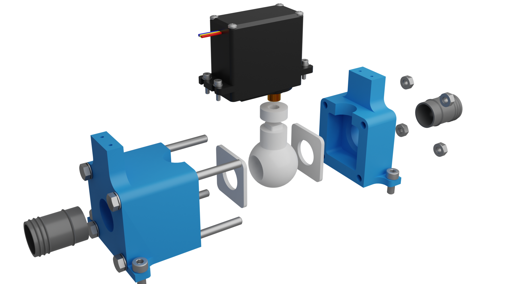
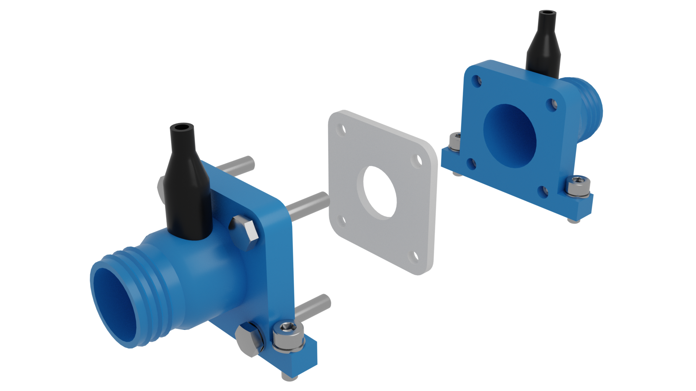

**Full project presentation available at: https://protors.co/lungstors/**
# 3D Models

All of technical documentation given here is made using FreeCAD. Using the FreeCAD native file format, anyone can see how we designed all the models and can easily edit and adapt the design to personal needs. FreeCAD is an open-source parametric 3D modeler made primarily to design real-life objects of any size.

## BLOWER
In folder `compressor_assembly` 3D models of our blower are available.

  

## SERVO VALVE
In folder `servo_valve_assembly` 3D models of our servo valve are available.

  

## FLOW METER
In folder `flowmeter_assembly` 3D models of our flow meter are available.

  

